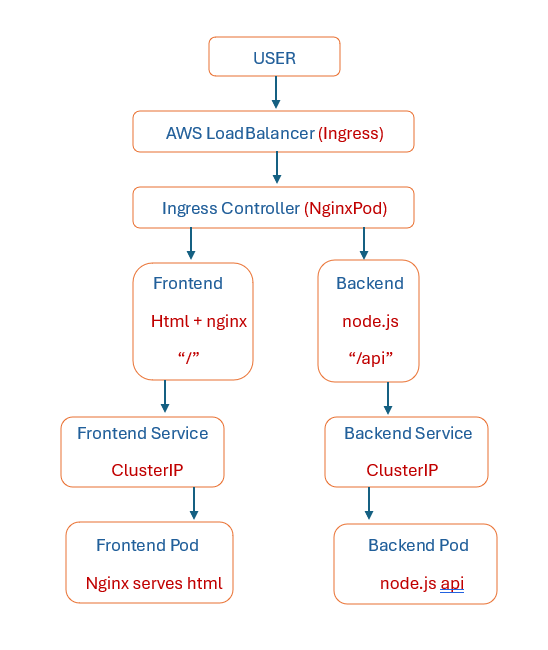

# DevOps Project 4 — CI/CD with Kubernetes (EKS)
*************************************************

## Overview
**************
This project demonstrates a complete DevOps pipeline for deploying a containerized full-stack application
using Docker, Kubernetes (EKS), and GitHub Actions.
Also the system includes a frontend UI and a backend API, exposed through a single entry point 
using Kubernetes Ingress with path-based routing.

### Architecture
******************

#### CI/CD Pipeline & how it works
**************************************
GitHub Push -> GitHub Actions -> Docker Build -> DockerHub Push -> AWS EKS Deployment -> Updated Pods Running Automatically
then users access the app via a single ELB URL.

##### Technologies Used
***************************
- GitHub Actions (CI/CD)
- Kubernetes (AWS EKS)
- Kubernetes Ingress
- AWS LoadBalancer
- Docker
- Node.js (Backend API)

 ###### Features
 *****************
 - Full CI/CD pipeline automation
 - Dockerized frontend and backend
 - Kubernetes deployments and services
 - Ingress path-based routing: 	1)  "/"  ->frontend   2)  "/api"  ->backend
 - Single public entry point

###### Key Learnings
***********************
-	Kubernetes Ingress vs LoadBalancer
-	Debugging CrashLoopBackOff
-	CI/CD integration with cloud infrastructure (AWS)
-	Docker image versioning and deployment
-	Service communication inside Kubernetes

###### FRONTEND
*****************

###### BACKEND
******************

###### Live Demo
*******************
FRONTEND: http://a8919917d1c5c474aadc9e0ea6601ba9-631009467.eu-north-1.elb.amazonaws.com/
********************************************************************************************************************************************************************
BACKEND: http://a8919917d1c5c474aadc9e0ea6601ba9-631009467.eu-north-1.elb.amazonaws.com/api
********************************************************************************************************************************************************************
The live demo is currently unavailable because the AWS EKS cluster was decommissioned to avoid ongoing infrastructure costs.
This project was successfully deployed and tested using AWS EKS with a LoadBalancer service. The full CI/CD pipeline and 
Kubernetes configuration are included in this repository and can be redeployed at any time.

